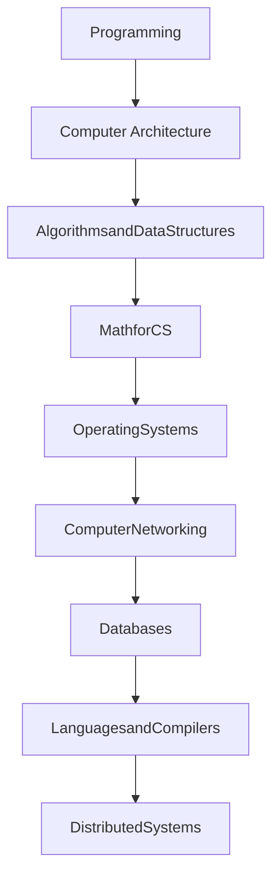

import Tabs from '@theme/Tabs';
import TabItem from '@theme/TabItem';

## Appendix 1: Boolean Function Synthesis

## Appendix 2: Hardware Description Language

tbd 

## Appendix 3: Test Description Language

tbd 

## Appendix 4: The Hack Chip Set

tbd 

## Appendix 5: The Hack Character Set

tbd 

## Appendix 6: The Jack OS API

tbd 

